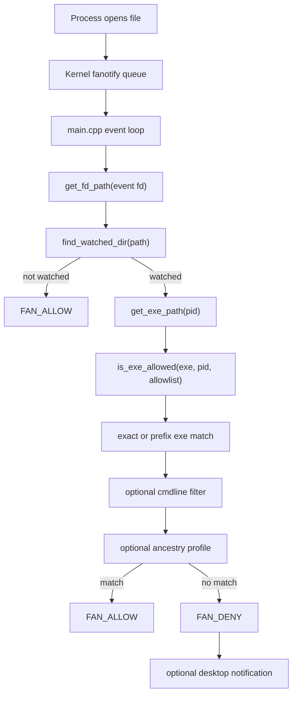

# Contributing to dirblock

This document is for contributors who want to understand or change dirblock internals. For installation and basic use, start with [README.md](README.md).

## Architecture

dirblock is a small userspace permission daemon built around fanotify `FAN_OPEN_PERM` events. It marks the mount points that contain watched directories, receives every open permission event on those mounts, filters to configured watched paths, and decides allow or deny from process identity and optional ancestry profiles.



## Runtime Interactions

Startup:
1. Parse CLI flags in `main.cpp`.
2. Locate config from `--config`, binary-relative `../config/dirblock.toml`, `~/.config/dirblock/dirblock.toml`, or `/etc/dirblock/dirblock.toml`.
3. Build the generated built-in `dirblock` ancestry profile from the daemon's current parent chain.
4. Load TOML config and resolve explicit `[profiles]`.
5. Resolve rules using the built-in `dirblock` profile.
6. Initialize fanotify and mark each watched directory's mount point.
7. Enter the permission event loop.

Event handling:
1. `fan_read_events()` returns pending fanotify permission events.
2. `get_fd_path()` resolves the event file descriptor to the target path.
3. `find_watched_dir()` checks whether the target path falls under a watched directory.
4. Non-watched paths are allowed immediately.
5. Watched paths resolve `/proc/<pid>/exe` and call `is_exe_allowed()`.
6. Denied events log process details and optionally notify the desktop.

## Core Files

`src/main.cpp`
- Owns CLI parsing, config discovery, startup logging, fanotify setup, signal handling, and the main event loop.
- Builds and logs the generated `dirblock` ancestry profile.
- Guarantees every fanotify event receives a response, even on exceptions.

`src/config.cpp` / `src/config.hpp`
- Loads the TOML config.
- Expands `~` with `SUDO_USER` awareness.
- Parses allow entries:
  - exact path
  - prefix path ending in `/`
  - cmdline filter with `filter:path`
  - ancestry profile with `path;profile`
- Parses `[profiles]`.
- Implements `find_watched_dir()`, `is_exe_allowed()`, ancestry matching, and mount detection.

`src/procinfo.hpp`
- Resolves `/proc/<pid>/exe`.
- Reads `/proc/<pid>/stat` to get `ppid` and `starttime`.
- Builds validated process snapshots by reading stat, exe, then stat again.
- Resolves `/proc/self/fd/<event_fd>` to the opened path.
- Reads `/proc/<pid>/cmdline` for cmdline filters and deny logs.

`src/fanotify.cpp` / `src/fanotify.hpp`
- Wraps `fanotify_init()`, `fanotify_mark()`, event reads, and allow/deny responses.
- Uses `FAN_CLASS_CONTENT`, `FAN_OPEN_PERM`, and mount marks.
- Caps reads to the caller's event buffer so permission events are not left unprocessed.

`src/notify.hpp`
- Sends rate-limited `notify-send` desktop notifications for denials.
- Drops to the real user when running through `sudo` so D-Bus session notifications work.

`src/toml_mini.hpp`
- Minimal TOML parser for the config subset used by dirblock.

## Config Model

Config shape:

```toml
[general]
notify = true

[profiles]
"remote_ssh" = [
    "/usr/bin/bash",
    "/usr/sbin/sshd",
]

[watched]
"~/.ssh" = [
    "/usr/bin/ssh",
    "/usr/bin/cat;dirblock",
    "/usr/bin/cat;remote_ssh",
]
```

Allow rules:
- `"/usr/bin/ssh"`: exact executable path.
- `"~/.local/share/claude/versions/"`: executable path prefix.
- `"claude:~/.bun/bin/bun"`: path match plus cmdline substring.
- `"/usr/bin/cat;remote_ssh"`: path match plus ancestry profile.
- `"filter:/path;profile"`: path, cmdline filter, and ancestry profile.

Profile rules:
- Profile entries are path-only exact or prefix rules.
- Profiles do not recurse.
- Profiles do not support cmdline filters.
- Missing or unreadable ancestry data denies that profile-constrained rule.
- Other matching allow rules are still tried before the final decision.

The generated `dirblock` profile is special: config may reference `;dirblock` without defining `[profiles].dirblock`. `main.cpp` builds it at startup and calls `resolve_builtin_profile()`.

## Security Invariants

- Always respond to every fanotify permission event.
- Always close every event file descriptor.
- Keep the fast path cheap: do not inspect process identity for files outside watched directories.
- Match executable paths by full `/proc/<pid>/exe`, not basename.
- Do not cache PID identity across events unless the cache has a process-instance proof.
- For ancestry checks, validate process snapshots with `starttime`.
- Treat ancestry uncertainty as a failed profile match.
- Avoid broad unprofiled allows for general-purpose readers, editors, shells, and runtimes.

## Build

```bash
make              # release build
make debug        # debug build with AddressSanitizer
make clean
make install      # install binary and config under ~/.local and ~/.config
```

Runtime commands:

```bash
dirblock                                  # use default config search path
dirblock --config config/dirblock.toml    # use an explicit config
dirblock --dry-run                        # log denials but allow access
dirblock --dry-run -v                     # also log fast-path allows
```

`make install` installs the binary to `~/.local/bin/dirblock` and copies `config/dirblock.toml` to `~/.config/dirblock/dirblock.toml`. After install, grant capabilities:

```bash
sudo setcap cap_sys_admin,cap_sys_ptrace+ep ~/.local/bin/dirblock
```

## Testing

Build checks:

```bash
make clean && make
bash -n test_dirblock_policy.sh
```

Runtime smoke checks require dirblock to be installed and running:

```bash
./test_dirblock_policy.sh
DIRBLOCK_EXPECT_CAT=DENIED DIRBLOCK_EXPECT_LESS=DENIED ./test_dirblock_policy.sh > test_results.txt
```

`test_dirblock_policy.sh` checks the current policy without printing protected file contents. It captures command output in a temporary directory and deletes it. The summary reports allow/deny observations and denial stderr, not successful command output. See [test_results.md](test_results.md) for current manual and scripted results.

Dry-run policy discovery:

```bash
dirblock --dry-run -v --config config/dirblock.toml
```

Exercise the tools that should access watched directories, then inspect `DRY-RUN DENY` lines. Add only the smallest rule that explains legitimate access.

## Updating Configs

`update_config.md` is an assistant playbook for local `config/dirblock.toml` changes after a user sees unwanted `DENIED` or `DRY-RUN DENY` messages. It is intentionally stricter than normal docs:
- It tells assistants to edit only `config/dirblock.toml` for the smallest local allow rule that explains legitimate access.
- It explicitly does not generate or maintain `config/dirblock_default.toml`.
- It uses `which` plus `readlink -f` for real executable paths.
- It comments out common binaries that are not found.
- It prefers ancestry-profiled rules for general-purpose tools.

`generate_config.py` is the deterministic config generator and the source of truth for repository defaults. It writes host-specific `config/dirblock.toml` by default, and writes the broad reference catalog `config/dirblock_default.toml` with `--default`. It backs up any different existing output before replacing it. Use the generator when the desired policy belongs in the common/local/optional watch lists instead of being an ad hoc local exception.

Generator shape:

```python
Watch(
    path="~/.codex",
    title="OpenAI Codex CLI",
    entries=(
        Entry(value="~/.bun/install/global/node_modules/@openai/", comment="prefix: codex native binary"),
        Entry(command="git", standard_paths=("/usr/bin/git",), comment="codex clones plugins into ~/.codex/.tmp/"),
        Entry(value="/usr/lib/git-core/git", comment="git subprocess"),
        Entry(value="/usr/lib/git-core/git-remote-http", comment="git-remote-https is same binary"),
        Entry(command="cursor", standard_paths=("/usr/share/cursor/cursor", "/usr/bin/cursor"), comment="Cursor reads Codex history"),
        Entry(value="/usr/bin/bash", comment="codex shell snapshots"),
    ),
)
```

`Watch` parameters:
- `path`: watched directory key to emit under `[watched]`. It can use `~`; dirblock expands it at runtime.
- `title`: comment heading emitted above that watched directory.
- `entries`: ordered allowlist entries for that watched directory. Keep one executable or prefix per `Entry`.
- `check_paths`: optional existence probes. The current generator renders a watch when `path` exists; use `check_paths` only if rendering should later become conditional on a more specific credential file.
- `always_render`: emit the watch even when the watched path does not exist. Use this for opt-in templates such as `~/.cargo-for-the-paranoid`, `~/.config/git-for-the-paranoid`, and `~/.pki-for-the-paranoid`.

`Entry` parameters:
- `value`: emit this exact allowlist value, such as an exact executable, a prefix ending in `/`, a cmdline-filtered value like `claude:~/.bun/bin/bun`, or a profiled value like `/usr/bin/cat;dirblock`.
- `command`: discover an executable by command name only after checking `standard_paths`. If discovery falls back to `PATH`, the generator emits an active entry with a warning comment and prints a CLI warning.
- `standard_paths`: trusted absolute paths to check before using `PATH`. Put distro/package-manager locations here, such as `/usr/share/cursor/cursor` before `/usr/bin/cursor`.
- `suffix`: append text to the resolved path, mainly for ancestry profile suffixes such as `;dirblock` or `;remote_ssh`.
- `filter`: prepend a cmdline filter to the resolved path. Prefer spelling runtime filters directly in `value` unless the same command-based path resolution is also needed.
- `comment`: inline TOML comment explaining why the entry exists.
- `missing_comment`: inline comment for commented-out entries when neither `standard_paths` nor `PATH` finds the command. The default is `not found`.

When adding a rule to `generate_config.py`, prefer `command` plus `standard_paths` for common binaries, and prefer `value` for stable prefixes, project-specific paths, or already-filtered runtime rules. Default-template rendering expands all standard variants, while host rendering comments out missing exact paths and de-duplicates equivalent resolved entries.

Keep high-noise or self-blocking watches opt-in unless there is a strong reason to make them active. `~/.pki`, `~/.config/git`, and `~/.cargo` are intentionally represented as `-for-the-paranoid` watches; `~/.cargo` is especially easy to self-block because standard Rust installs put `cargo` and `rustup` under the watched directory.

After changing the generator, run:

```bash
python3 generate_config.py
python3 generate_config.py --default
make
./dirblock --dry-run --config config/dirblock.toml
```

## Release Checklist

Before opening or updating a merge request:
1. Run `make clean && make`.
2. Run `bash -n test_dirblock_policy.sh`.
3. If dirblock is installed and running, run relevant smoke tests.
4. Review `README.md`, `CONTRIBUTING.md`, `ADMIN_GUIDE.md`, `update_config.md`, and `test_results.md` for consistency.
5. Check `git diff --check`.
